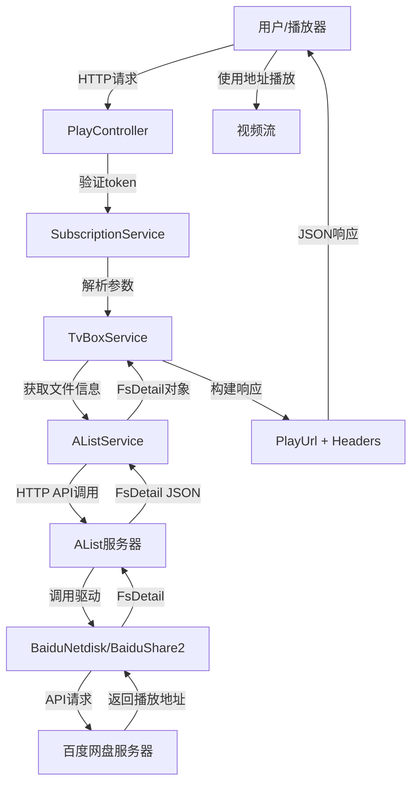
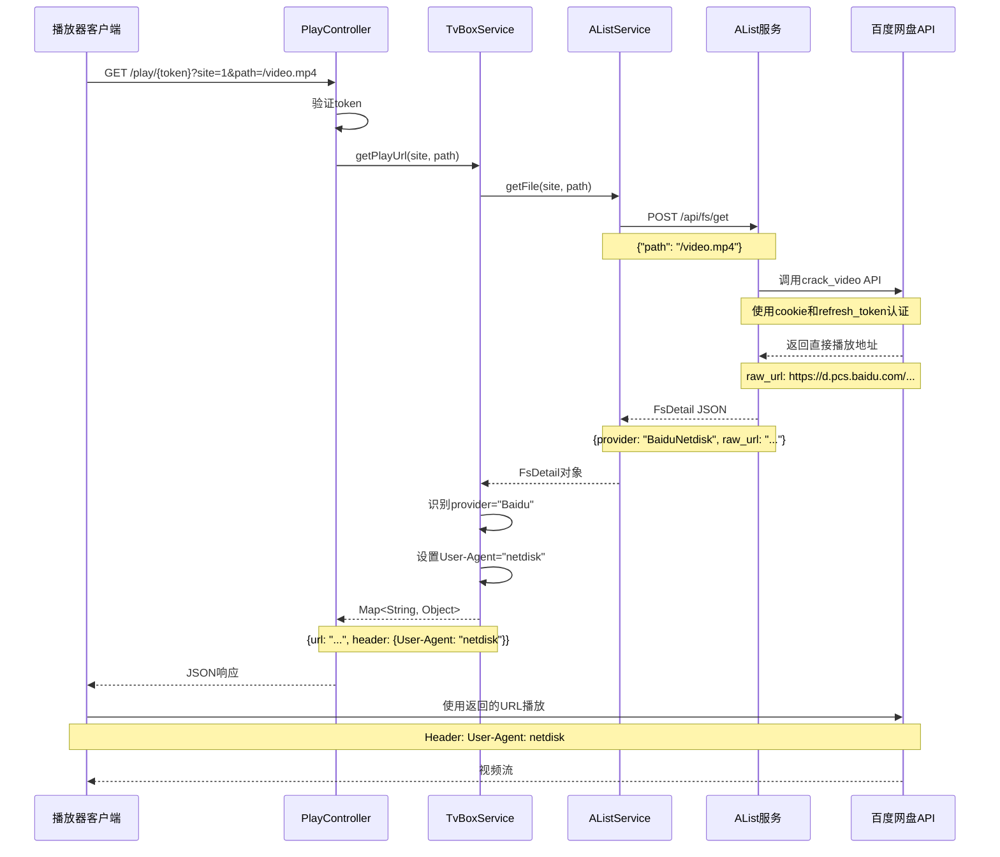
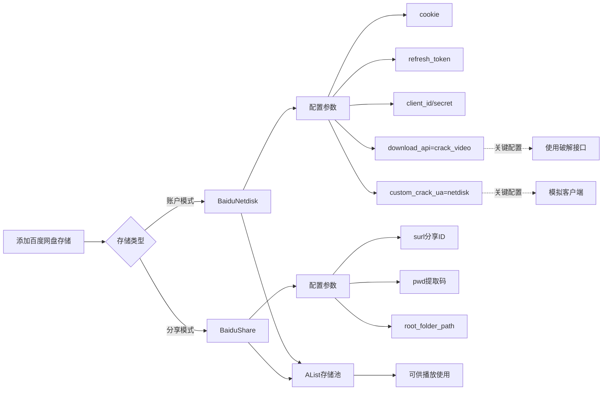
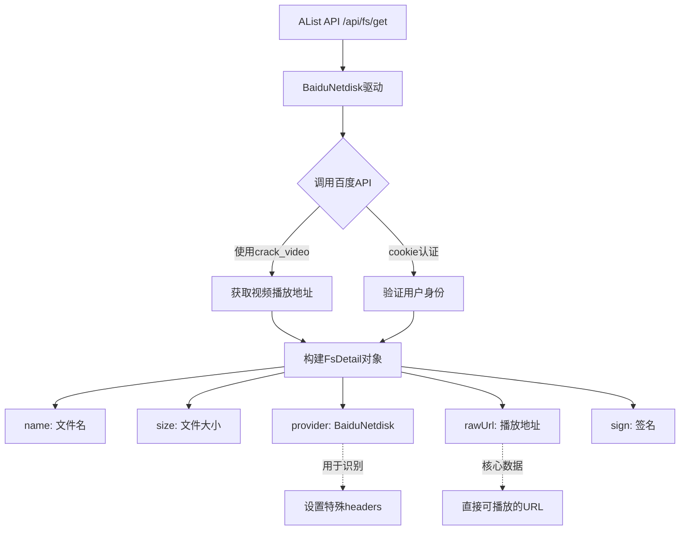
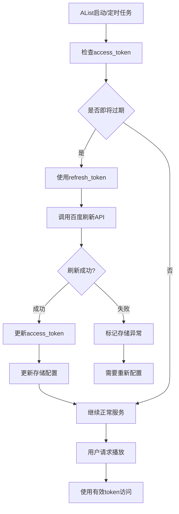
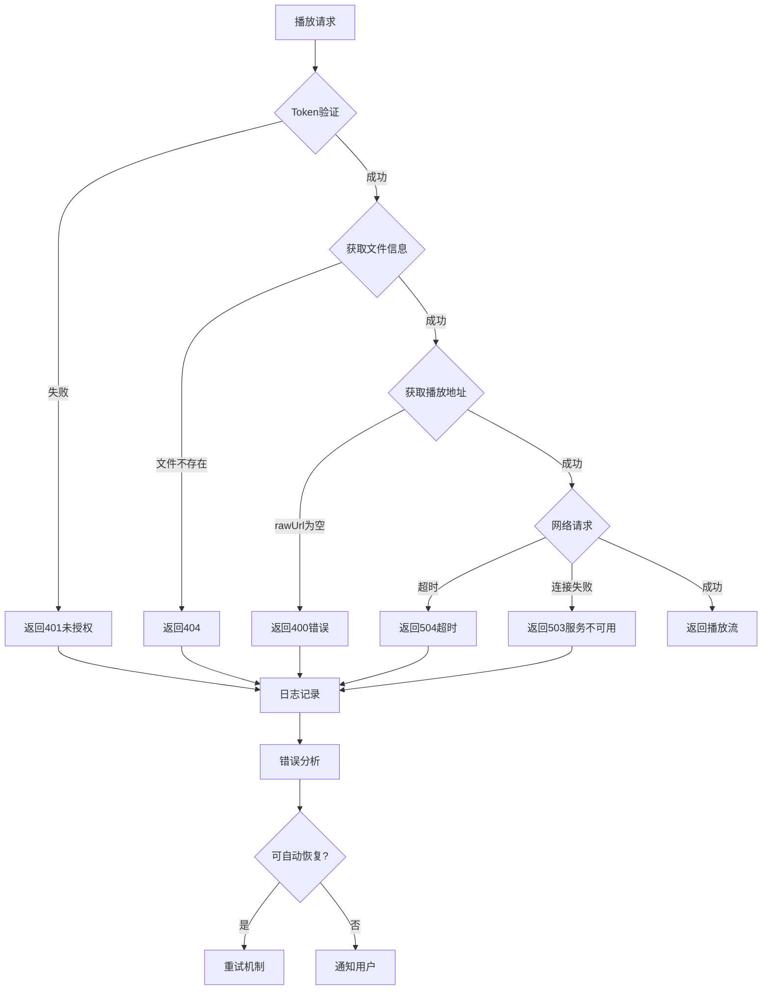
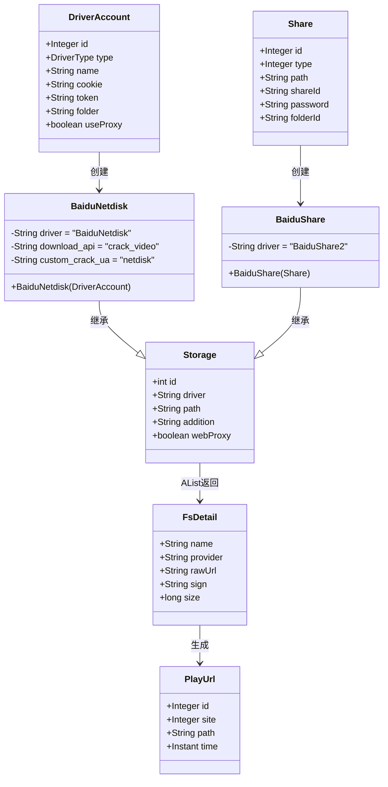
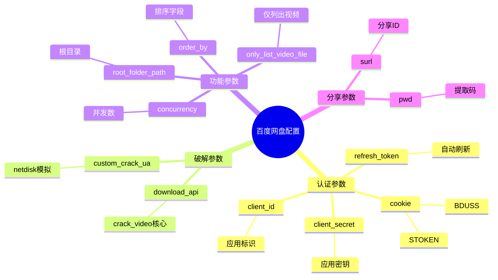

# 百度网盘播放地址提取流程图

## 1. 整体架构流程



## 2. 详细请求流程



## 3. 存储配置流程



## 4. FsDetail数据流



## 5. 代理判断流程

```mermaid
graph TB
    A[获取到rawUrl] --> B{检查URL类型}
    
    B -->|包含.strm| C[读取STRM文件内容]
    C --> D[302重定向到真实URL]
    
    B -->|包含.m3u8| E[302重定向]
    
    B -->|包含baidu.com| F{检查是否需要代理}
    F -->|用户配置useProxy| G[使用AList代理]
    F -->|直连模式| H[直接返回rawUrl]
    
    B -->|其他云盘| I{根据provider判断}
    I -->|需要代理| G
    I -->|可直连| H
    
    G --> J[buildAListProxyUrl]
    J --> K[/p/path?sign=xxx]
    
    H --> L[返回原始URL]
    
    K --> M[添加特殊headers]
    L --> M
    
    M --> N{provider类型}
    N -->|Baidu| O[User-Agent: netdisk]
    N -->|Quark| P[User-Agent: Quark UA + Cookie]
    N -->|Ali| Q[User-Agent: Ali UA + Referer]
    
    O --> R[最终播放配置]
    P --> R
    Q --> R
```

## 6. ProxyService处理流程

```mermaid
graph TB
    A[播放器请求代理] --> B[/p/token/site@id]
    B --> C[ProxyService.proxy]
    
    C --> D[解析参数获取PlayUrl]
    D --> E[从数据库获取path]
    E --> F[AListService.getFile]
    
    F --> G[获取FsDetail]
    G --> H{判断driver类型}
    
    H -->|BaiduNetdisk| I[需要代理]
    H -->|BaiduShare2| I
    H -->|其他proxyDrivers| I
    H -->|可直连| J[302重定向]
    
    I --> K[buildAListProxyUrl]
    K --> L[构建AList代理地址]
    L --> M[/p/path?sign=xxx]
    
    M --> N[设置headers]
    N --> O[User-Agent: netdisk]
    N --> P[Referer: 适当的referer]
    
    O --> Q[downloadStraight]
    P --> Q
    
    Q --> R[建立HTTP连接]
    R --> S[流式传输]
    S --> T[返回给播放器]
```

## 7. Token刷新机制



## 8. 错误处理流程



## 9. 数据模型关系



## 10. 关键配置参数说明



## 流程总结

### 核心流程链路

1. **请求阶段**: 用户 → PlayController → TvBoxService
2. **获取阶段**: TvBoxService → AListService → AList → 百度网盘
3. **处理阶段**: 识别provider → 设置headers → 判断代理
4. **返回阶段**: 构建响应 → 返回URL和headers → 播放器播放

### 关键技术点

- **破解接口**: `download_api: "crack_video"`
- **UA伪装**: `User-Agent: "netdisk"`
- **自动刷新**: refresh_token机制
- **代理支持**: AList的/p接口
- **灵活配置**: 支持账户和分享两种模式
